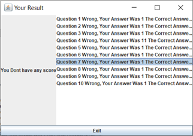

# Java Small Math Game

This is a simple **Math Game** developed in Java using NetBeans as part of my student project.  
It features randomized number and question generation, with score tracking implemented using arrays.
Players are presented with math questions, and scores are calculated based on correct answers in real time.

## Feature

- **Practice Mode**: Real-time answer checking for randomly generated questions.
- **Scoring Mode**: 10-question quiz with final score and answer summary.
- **Answer Mode**: Input your own question and answer to compare with the system's result.
- **Multiple difficulty levels:**
  - Easy - Generates addition and subtraction questions.
  - Medium - Include multiplication questions.
  - Hard - Adds division questions for a greater challange.

## Technologies Used

- Java (Netbeans)
- Object Oriented Programming

## Screenshots

- **Intro Page**

  

- **Menu Page**

  

- **Practice Mode**

  
  
  

- **Scoring Mode**

  
  
  

- **Answer Mode**

  
  
